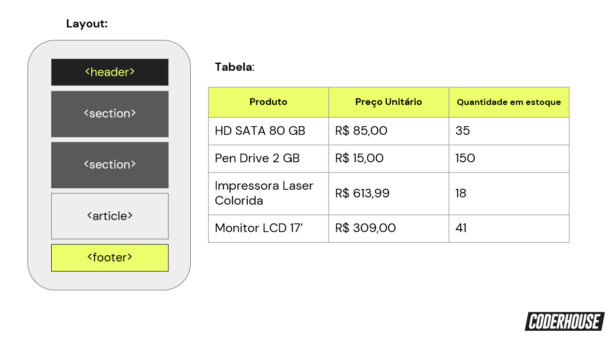

# Desafio Compementar - Aula 06
#### Curso - Desenvolvimento web

***
## Descrição da atividade:

-   Crie uma página seguindo o layout da imagem a seguir (Use HTML semântico nas tags e meta tags);
    
-   No **header** insira algumas informações genéricas ou pessoais (nome, profissão, idade, signo, etc.);
-   Na primeira **section** insira uma receita usando listas ordenadas para o passo a passo e não ordenadas para os ingredientes, deixe também o link para acessar a referência;
-   Na segunda **section** insira a tabela mostrada na imagem a seguir
-   No **article** insira uma notícia recente com uma imagem, deixe também o link para acessar a referência;
    \*No **footer** insira suas informações de contato (email, telefone, etc);

###Formato

-   Link do código no GitHub e da publicação no GitHub Pages

## Resultado

